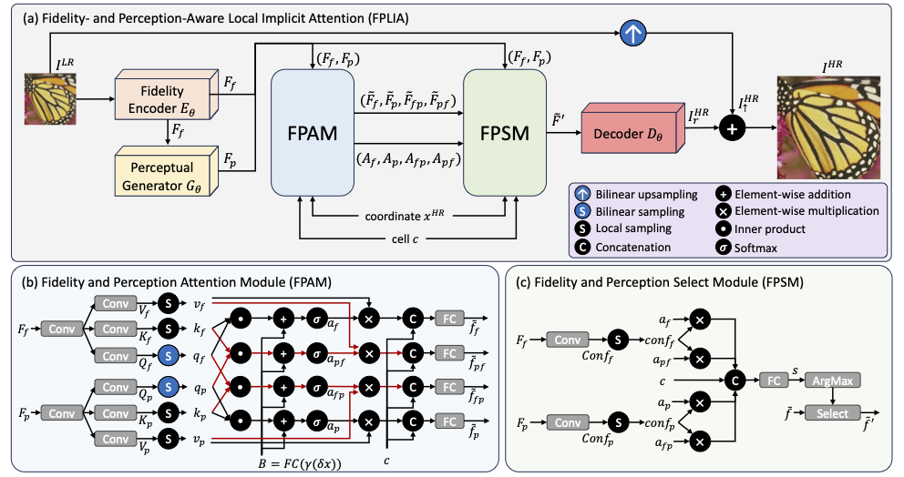

# [Fidelity- and Perception-Aware Local Implicit Attention for Arbitrary-Scale Image Super-Resolution](https://xusean0118.github.io/FPLIA/)

[Yu-Syuan Xu](https://xusean0118.github.io) , Hao-Lun Sun , [Hao-Wei Chen](https://github.com/jaroslaw1007) , Hsien-Kai Kuo , Chun-Yi Lee

### 🎉 Paper accepted at ECCV 2026

<hr />

> **Abstract:** *Arbitrary-scale image super-resolution (ASISR) aims to reconstruct high-resolution images from low-resolution inputs over a continuous range of upscaling factors. 
While traditional pixel-regression approaches often produce overly smooth results that lack realistic details, recent diffusion  methods can produce sharper and more realistic textures. However, these diffusion techniques frequently introduce the risk of structural hallucinations. To address these issues, we propose Fidelity- and Perception-Aware Local Implicit Attention (FPLIA), a framework that effectively integrates fidelity-oriented features into a diffusion  pipeline to produce realistic and faithful reconstructions for ASISR. 
We introduce a Fidelity and Perception Attention Module (FPAM), which applies both self-attention and cross-attention to fidelity-oriented and perceptual features to enhance representational capacity. To further exploit their complements, we design a Fidelity and Perception Select Module (FPSM) that adaptively selects the most representative features for RGB values prediction. We conduct extensive experiments to validate the effectiveness of these components. Both qualitative and quantitative results show that FPLIA delivers superior perceptual realism while maintaining reconstruction accuracy on standard ASISR benchmarks.* 
<br>

<hr />

## 📚 Table of Contents
- [Network Architecture](#-network-architecture)
- [Installation](#-installation)
- [Training](#-training)
- [Testing](#-testing)
- [Acknowledgements](#-acknowledgements)

<hr />

## 🏗️ Framework
<table>
  <tr>
    <td>  </td>
  </tr>
  <tr>
    <td><p align="center"><b>Overall Framework of FPLIA</b></p></td>
  </tr>
</table>

<hr />

## 💻 Installation
We use Python=3.12.2 and PyTorch>=2.8 with single B200.

Installation of required packages:
```bash
pip install -r requirements.txt
```

<hr />

## 🚂 Training
```bash
python3 main.py --base [CONFIG] --device [NUM_GPU]
```
| Parameter      | Description                        |
|----------------|------------------------------------|
| **`CONFIG`**   | Path to the configuration file. |
| **`NUM_GPU`**  | Number of GPUs. |

<hr />

## 🧪 Testing 

[\[>> Checkpoints <<\]](https://drive.google.com/drive/folders/1H_4WW_DFd-OSKvRPuCrZKXqE9Ytvw12C?usp=sharing)

```bash
python3 test.py --exp [EXP_FOLDER] --dataset [DATASET] (--save_image)
```

| Parameter          | Description                            |
|--------------------|----------------------------------------|
| **`EXP_FOLDER`**   | Path to the trained experiment folder. |
| **`DATASET`**      | Name of the dataset.                   |
| **`--save_image`** | Save the output images. (Optional).    |

<hr />

## 📜 Acknowledgements

This repo is built on [CLIT](https://github.com/jaroslaw1007/CLIT) and [arbitrary-scale-diffusion](https://github.com/zhenshij/arbitrary-scale-diffusion). Thanks the authors for their contributions and generosity.

<hr />